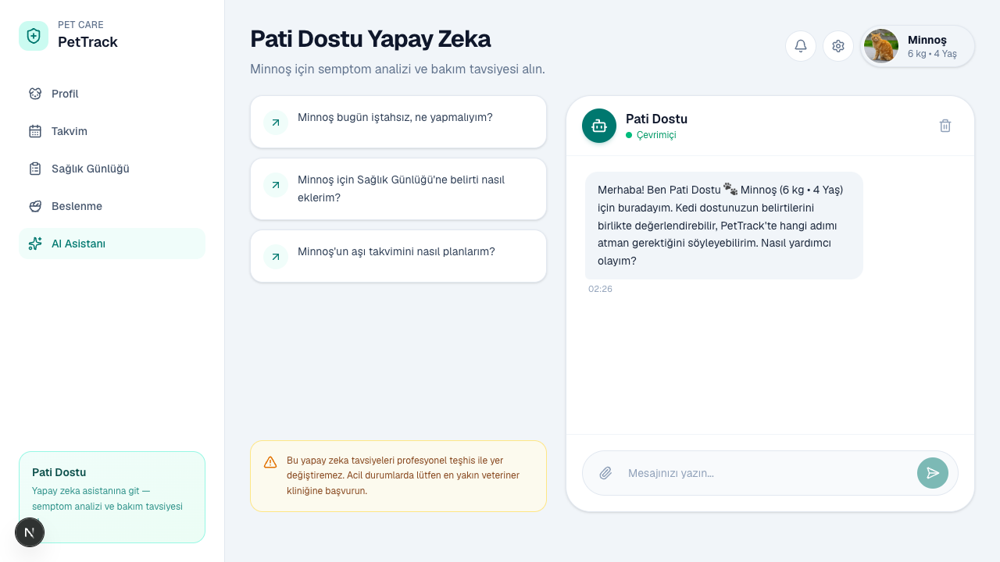
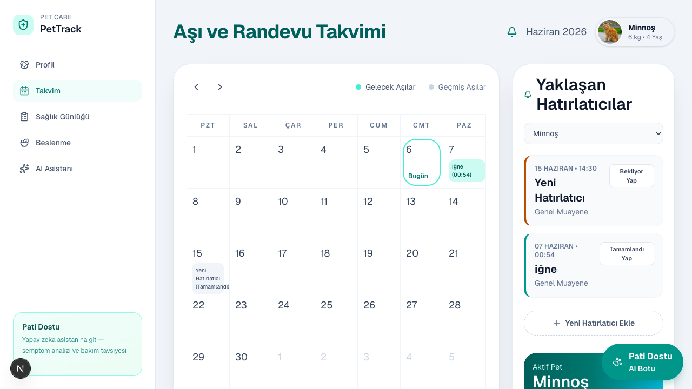
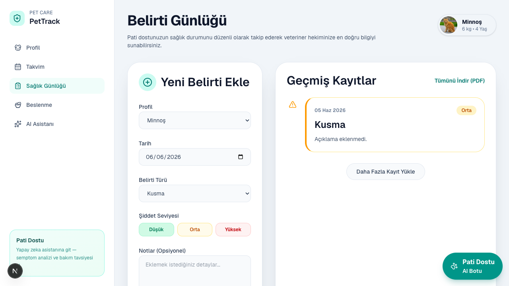
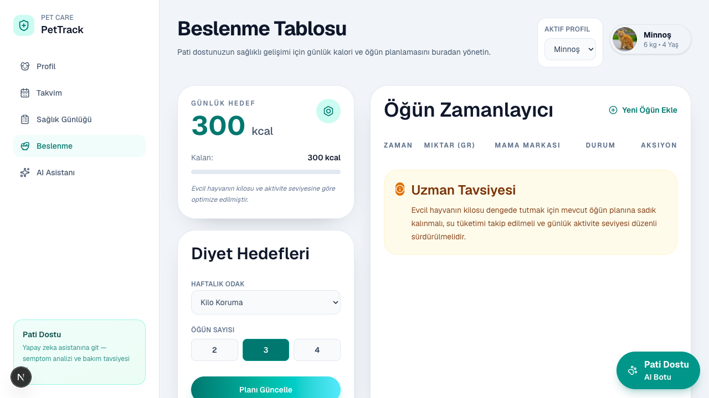
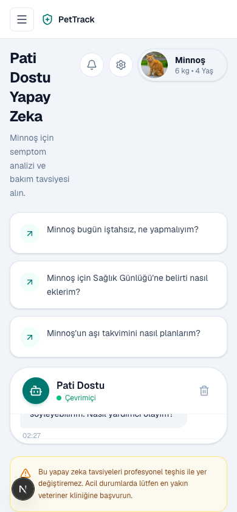

# 🐾 PetTrack

**AI-Powered Pet Health & Care Assistant**

Evcil hayvan profili, aşı takvimi, belirti günlüğü ve beslenme planını tek yerden yönet. **Pati Dostu** yapay zeka asistanına Türkçe sorular sor — kayıtlı verilerine göre kişiselleştirilmiş bakım tavsiyesi al.

Next.js · Flutter · TypeScript · Prisma · PostgreSQL · Google Gemini · MVP

---

## 🚀 Canlı Proje

| Bileşen | Durum | Adres |
|---------|--------|--------|
| **Web arayüz** | ⏳ Deploy planlanıyor | `https://pettrack.vercel.app` *(yakında)* |
| **REST API** | ⏳ Deploy planlanıyor | `https://pettrack-api.vercel.app` *(yakında)* |
| **Yerel web** | ✅ Çalışıyor | http://localhost:1575 |
| **Yerel API** | ✅ Çalışıyor | http://localhost:1571/api |

> Deploy tamamlandığında bu bölüm güncellenecek. Yerel demo için [Kurulum](#-yerel-geliştirme) bölümüne bakın.

---

## 📖 Genel Bakış

**PetTrack**, evcil hayvan sahiplerinin sağlık ve bakım verilerini dağınık notlar yerine tek uygulamada toplamasını sağlar. Web arayüzü ve Flutter mobil uygulama, aynı REST API üzerinden PostgreSQL veritabanına bağlanır.

**Pati Dostu**, Google Gemini ile çalışan Türkçe AI asistanıdır. Aktif pet profiline, son belirtilere, aşı kayıtlarına ve öğün planına bakarak semptom analizi ve pratik bakım adımları önerir — profesyonel teşhisin yerini almaz.

---

## 🎯 Problem

Birçok evcil hayvan sahibi:

- Aşı tarihlerini telefon notlarında tutar, hatırlatıcı kaçırır
- Belirti geçmişini veteriner randevusuna giderken hatırlamaya çalışır
- Beslenme düzenini kafasında takip eder
- “Bu normal mi, ne zaman veterinere gitmeliyim?” sorusuna hızlı yanıt bulamaz
- Mevcut uygulamalar ya çok genel ya da Türkçe destekten yoksundur

---

## 💡 Çözüm

PetTrack hafif ama etkileşimli bir sağlık takip deneyimi sunar:

| Yapabilirsin | Nasıl |
|--------------|--------|
| Birden fazla pet profili oluştur | Kedi, köpek, kuş — fotoğraf, kilo, yaş |
| Aşı ve randevu planla | Takvim — Bekliyor / Tamamlandı |
| Belirti kaydet | Sağlık günlüğü — şiddet seviyesi, CSV export |
| Beslenmeyi takip et | Diyet hedefleri, öğün planlayıcı |
| AI'ya Türkçe sor | Pati Dostu — Gemini, pet bağlamlı yanıt |

---

## 🖼 Ekran Görüntüleri

### Web — Hayvan Profilleri


### Web — Pati Dostu AI



### Web — Takvim · Belirti · Beslenme

| Takvim | Sağlık günlüğü | Beslenme |
|:------:|:--------------:|:--------:|
|  |  |  |

### Mobil — Flutter (iOS)


### Mobil — Web responsive görünüm



> Daha fazla görüntü: [`docs/screenshots/`](./docs/screenshots/)

---

## ✨ Özellikler

### Hayvan profilleri
- Çoklu pet desteği (kedi / köpek / kuş)
- Profil fotoğrafı yükleme ve tür bazlı varsayılan avatar
- Aktif pet seçimi — tüm modüllerde geçerli
- Profil silme (web + mobil)

### Takvim & aşı takibi
- Aşı ve randevu hatırlatıcıları
- Aylık takvim görünümü
- Bekliyor / Tamamlandı durumları

### Sağlık günlüğü
- Belirti türü, açıklama, şiddet (Düşük / Orta / Yüksek)
- Pet bazlı filtreleme
- CSV dışa aktarma (`belirti-kayitlari.csv`)

### Beslenme
- Günlük kalori hedefi
- Diyet hedefleri (kilo koruma / verme / alma)
- Öğün planlayıcı ve tamamlama onayı

### Pati Dostu — AI Asistan
Kullanıcılar şunları sorabilir:

- *Minnoş bugün iştahsız, ne yapmalıyım?*
- *Köpeklerde aşı sonrası halsizlik normal mi?*
- *Sağlık Günlüğü'ne belirti nasıl eklerim?*

AI yanıtı içerir:
- Doğrudan cevap ve pratik bakım adımları
- PetTrack'te hangi sayfaya gidileceği
- Kayıtlı belirti/aşı verisine atıf (varsa)
- Tıbbi disclaimer — acilde veterinere yönlendirme

---

## 🏗 Mimari

```
┌─────────────────────┐     ┌─────────────────────┐
│  Next.js Frontend   │     │  Flutter Mobile     │
│  (port 1575)        │     │  iOS · Android      │
└──────────┬──────────┘     └──────────┬──────────┘
           │    NEXT_PUBLIC_API_URL     │
           └─────────────┬──────────────┘
                         ▼
           ┌─────────────────────────────┐
           │  Next.js Backend API        │
           │  Route Handlers (port 1571) │
           │  Prisma · CORS middleware   │
           └─────────────┬───────────────┘
                         │
           ┌─────────────┴─────────────┐
           ▼                           ▼
   ┌───────────────┐           ┌───────────────┐
   │  PostgreSQL   │           │  Google Gemini │
   │  (Supabase)   │           │  Pati Dostu AI │
   └───────────────┘           └───────────────┘
```

Frontend, Gemini veya veritabanına **doğrudan bağlanmaz**. Tüm istekler backend API üzerinden gider; `GEMINI_API_KEY` yalnız sunucuda tutulur.

---

## 🛠 Teknoloji Yığını

| Katman | Teknoloji |
|--------|-----------|
| Web arayüz | Next.js 16, React 19, Tailwind CSS 4 |
| Mobil | Flutter (iOS + Android) |
| Backend API | Next.js Route Handlers, TypeScript |
| Veritabanı | PostgreSQL + Prisma 7 |
| Yapay zeka | Google Gemini API (`gemini-2.5-flash`) |
| İkonlar | Lucide React (web) · Material Icons (mobil) |
| Monorepo | npm workspaces |
| Deploy (hedef) | Vercel + Supabase |

Detaylı gerekçeler: [`prodocs/tech-stack.md`](./prodocs/tech-stack.md)

---

## 📡 API Uç Noktaları

| Method | Endpoint | Açıklama |
|--------|----------|----------|
| GET/POST | `/api/pets` | Hayvan listesi / oluştur |
| GET/PATCH/DELETE | `/api/pets/[id]` | Tek hayvan CRUD |
| GET | `/api/pets/[id]/summary` | Dashboard özeti |
| GET/POST | `/api/calendar` | Aşı & randevu |
| PATCH/DELETE | `/api/calendar/[id]` | Tekil takvim |
| GET/POST | `/api/symptoms` | Belirti kayıtları |
| GET | `/api/symptoms/export` | CSV indir |
| GET/POST | `/api/nutrition` | Beslenme |
| GET | `/api/nutrition/summary` | Beslenme özeti |
| POST | `/api/uploads` | Profil fotoğrafı |
| GET | `/api/chat?petId=` | Pati Dostu meta (karşılama, öneriler) |
| POST | `/api/chat` | AI sohbet yanıtı |

---

## 📁 Klasör Yapısı

```
PetTrack/
├── frontend/
│   ├── app/                  # Next.js sayfaları
│   ├── components/           # AppShell, aktif pet rozeti
│   ├── lib/                  # api.ts, active-pet-context
│   └── mobile/               # Flutter uygulaması
│       └── lib/screens/      # profil, takvim, sağlık, beslenme, asistan
├── backend/
│   ├── app/api/              # REST route handlers
│   ├── lib/
│   │   ├── prisma.ts
│   │   └── pati-dostu-prompt.ts
│   ├── prisma/schema.prisma
│   └── py/                   # Opsiyonel FastAPI
├── docs/
│   └── screenshots/          # README ekran görüntüleri
├── prodocs/                  # PRD, Plan, DesignSystem, Progress
├── .env.example
└── README.md
```

---

## ⚙️ Yerel Geliştirme

### Gereksinimler

- Node.js 20+
- PostgreSQL
- (Mobil) Flutter SDK 3.x
- (AI) Google Gemini API key — [AI Studio](https://aistudio.google.com/apikey)

### Kurulum

```bash
git clone <repo-url>
cd PetTrack
npm install

cp .env.example backend/.env
cp .env.example frontend/.env
# backend/.env → DATABASE_URL, GEMINI_API_KEY
# frontend/.env → NEXT_PUBLIC_API_URL=http://localhost:1571

npm run prisma:generate
npm run prisma:migrate
npm run dev
```

| Adres | Açıklama |
|-------|----------|
| http://localhost:1575 | Web arayüzü |
| http://localhost:1571/api | REST API |

### Veritabanı

```bash
createdb pettrack
# veya Docker:
npm run db:up          # port 5433
npm run prisma:migrate
npm run prisma:studio
```

### Mobil (Flutter)

```bash
cd frontend/mobile
flutter pub get
flutter run
```

---

## 🔐 Ortam Değişkenleri

Şablon: [`.env.example`](./.env.example)

**Backend** (`backend/.env`):

```env
DATABASE_URL=postgresql://...
FRONTEND_ORIGIN=http://localhost:1575
GEMINI_API_KEY=
GEMINI_MODEL=gemini-2.5-flash
GEMINI_MAX_DAILY_REQUESTS=15
GEMINI_MAX_OUTPUT_TOKENS=640
GEMINI_THINKING_BUDGET=0
```

**Frontend** (`frontend/.env`):

```env
NEXT_PUBLIC_API_URL=http://localhost:1571
```

⚠️ Gerçek API anahtarlarını, veritabanı URL'lerini veya `.env` dosyalarını GitHub'a commit etmeyin.

---

## 🧭 Demo Akışı

1. `npm run dev` ile web + API'yi başlat
2. http://localhost:1575/pets adresine git
3. Yeni evcil hayvan profili ekle (ör. Minnoş, kedi)
4. Takvim'den aşı hatırlatıcısı ekle
5. Sağlık günlüğüne belirti kaydet
6. Beslenme sayfasında öğün planla
7. **Pati Dostu AI**'ya git — *"Minnoş bugün iştahsız, ne yapmalıyım?"* sor
8. Kişiselleştirilmiş yanıt ve PetTrack yönlendirmesini incele

---

## 🔒 Güvenlik Notları

- `GEMINI_API_KEY` yalnız backend ortam değişkeninde
- Frontend ve mobil istemci API key veya DB credential almaz
- AI yanıtları tıbbi teşhis değildir; acil durumlarda veteriner yönlendirmesi
- Günlük/dakikalık Gemini kota limitleri (`GEMINI_MAX_*`)
- CORS: `FRONTEND_ORIGIN` ile kısıtlı

---

## 📈 Yol Haritası

### v1.1
- [ ] Vercel + Supabase canlı deploy
- [ ] JWT / Apple Sign-In kimlik doğrulama
- [ ] `ownerId` erişim kontrolleri

### v2
- [ ] Push hatırlatıcıları (aşı, öğün)
- [ ] Belirti export PDF
- [ ] AI sohbet geçmişi bulut senkronu
- [ ] Offline-first mobil cache

### v3
- [ ] Veteriner kliniği entegrasyonu
- [ ] Çoklu kullanıcı / aile paylaşımı
- [ ] Giyilebilir cihaz / IoT verisi

---

## ✅ Mevcut Durum

**MVP v1.0 — Geliştirme tamamlandı, deploy bekliyor**

| Bileşen | Durum |
|---------|--------|
| Backend REST API | ✅ |
| PostgreSQL + Prisma | ✅ |
| Web arayüz (5 modül) | ✅ |
| Flutter mobil (5 ekran) | ✅ |
| Pati Dostu AI (Gemini) | ✅ |
| Kişiselleştirilmiş AI meta | ✅ |
| Aktif pet & çoklu profil | ✅ |
| CSV belirti export | ✅ |
| prodocs dokümantasyon | ✅ |
| Canlı deploy | ⏳ |

---

## 📄 Dokümantasyon

| Dosya | İçerik |
|-------|--------|
| [`prodocs/PRD.md`](./prodocs/PRD.md) | Ürün gereksinimleri |
| [`prodocs/tech-stack.md`](./prodocs/tech-stack.md) | Teknoloji ve AI entegrasyonu |
| [`prodocs/Plan.md`](./prodocs/Plan.md) | Teknik adımlar, user story'ler |
| [`prodocs/DesignSystem.md`](./prodocs/DesignSystem.md) | UI kuralları |
| [`prodocs/Progress.md`](./prodocs/Progress.md) | İlerleme günlüğü |
| [`prodocs/README.md`](./prodocs/README.md) | AI ajan referans indeksi |

---

## 🎓 Hakkında

PetTrack, **YGA Future Talent Programı — Modül 301 Bootcamp** kapsamında geliştirilen bir MVP projesidir.

Evcil hayvan sahiplerinin sağlık verilerini düzenli tutmasını ve yapay zeka destekli bakım tavsiyesi almasını hedefler.

---

<p align="center">
  <strong>PetTrack</strong> — Pati dostunuz için tek uygulama 🐾
</p>
