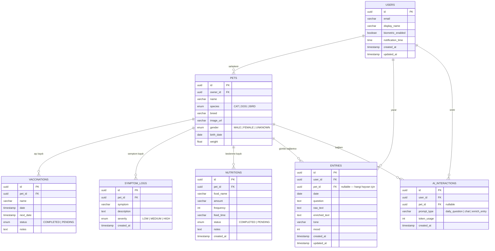

# PetTrack — Veri modeli (ER diyagramı)

Bu diyagram **PetTrack** projesinin hedef veri modelini tanımlar: sahip hesabı, evcil hayvan kayıtları (Next.js + Prisma, port **1571**), günlük diary / AI katmanı (`backend-py`, port **1572**).

| Katman | Konum | Durum |
|--------|--------|--------|
| `Pet`, `Vaccination`, `SymptomLog`, `Nutrition` | `backend/prisma/schema.prisma` | PostgreSQL’de uygulanmış |
| `User`, `Entry`, `AiInteraction` | `backend-py` + ileride Prisma | Hedef şema (aşağıdaki diyagram) |

---

## ER diyagramı

---

## Prisma ile eşleme (`backend/`)

| Diyagram | Prisma modeli | Not |
|----------|---------------|-----|
| `PETS` | `Pet` | `owner_id` → şemada `ownerId` (string; `User` tablosu henüz yok) |
| `VACCINATIONS` | `Vaccination` | |
| `SYMPTOM_LOGS` | `SymptomLog` | |
| `NUTRITIONS` | `Nutrition` | |

`USERS`, `ENTRIES` ve `AI_INTERACTIONS` henüz Prisma’da yok; `ownerId` şimdilik serbest metin / harici kimlik olarak kullanılıyor.

---

## `backend-py` ile eşleme

### Hedef (`ENTRIES` + günlük soru)

| Alan | Kaynak |
|------|--------|
| `question` | `GET /api/questions/daily` → `ai_service.generate_daily_question()` |
| `raw_text` | Kullanıcının günlük cevabı |
| `enriched_text` | AI ile zenginleştirilmiş metin (ileride) |
| `tone`, `mood` | AI çıktısı / kullanıcı seçimi |
| `pet_id` | İsteğe bağlı; hangi evcil hayvan için yazıldığı |

### Şu anki demo API (`routers/entries.py`)

Bellek içi kayıt; hedef şemaya geçişte alan eşlemesi:

| Demo alanı | Hedef alan |
|------------|------------|
| `title` | Kısa özet veya `question` özeti |
| `body` | `raw_text` |
| `pet_id` | `pet_id` |
| — | `user_id`, `date`, `enriched_text`, `tone`, `mood` eklenecek |

### AI etkileşimleri

| `prompt_type` | Servis |
|---------------|--------|
| `daily_question` | `backend-py` → `/api/questions/daily` |
| `chat` | `backend` → `/api/chat` (Pati Dostu) |
| `enrich_entry` | `backend-py` → `ai_service` (planlanan) |

---

## Endpoint özeti

### Next.js API (`:1571`)

| Kaynak | Örnek yol |
|--------|-----------|
| Evcil hayvan | `/api/pets` |
| Takvim / aşı | `/api/calendar` |
| Semptom | `/api/symptoms` |
| Beslenme | `/api/nutrition` |
| Sohbet | `/api/chat` |

### Python API (`:1572`)

| Metot | Yol | Açıklama |
|-------|-----|----------|
| GET | `/health` | Sağlık kontrolü |
| GET/POST | `/api/entries` | Günlük kayıtları (demo) |
| GET/PATCH/DELETE | `/api/entries/{id}` | Tek kayıt |
| GET | `/api/questions/daily` | Günlük soru → `ENTRIES.question` adayı |
