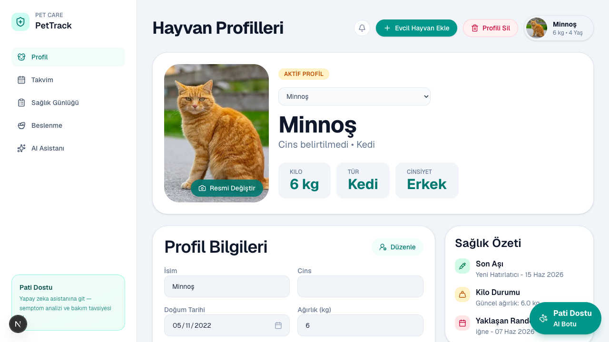

# 🌐 PetTrack — Web Frontend

Next.js 16 arayüzü — evcil hayvan profili, takvim, sağlık günlüğü, beslenme ve **Pati Dostu AI**.

| | |
|---|---|
| **Port (yerel)** | 1575 |
| **Canlı** | https://pettrack-frontend.vercel.app |
| **Stack** | Next.js · React 19 · Tailwind CSS 4 · Lucide |
| **API** | `NEXT_PUBLIC_API_URL` → backend |
| **Deploy** | Vercel — root `frontend/` · rehber: [`../prodocs/DEPLOY-vercel.md`](../prodocs/DEPLOY-vercel.md) |

---

## Sayfalar

| Rota | Modül |
|------|--------|
| `/pets` | Hayvan profilleri — CRUD, aktif pet, sil |
| `/calendar` | Aşı & randevu takvimi |
| `/symptoms` | Sağlık günlüğü — belirti, CSV export |
| `/nutrition` | Beslenme — diyet hedefleri, öğün planı |
| `/assistant` | Pati Dostu AI sohbet |

---

## Önemli dosyalar

```
app/                    # Sayfalar
components/app-shell.tsx
components/active-pet-avatar.tsx
lib/api.ts              # apiUrl() — asla göreli /api kullanma
lib/active-pet-context.tsx
```

---

## Çalıştırma

```bash
# Kökten (önerilen)
npm run dev

# Yalnız frontend
npm run dev -w frontend
```

`.env` (yerel):

```env
NEXT_PUBLIC_API_URL=http://localhost:1571
```

Canlı (Vercel `pettrack-frontend`):

```env
NEXT_PUBLIC_API_URL=https://pettrack-backend.vercel.app
```

---

## Ekran görüntüsü



Daha fazla: [`docs/screenshots/`](../docs/screenshots/)

---

Ana README: [../README.md](../README.md)
