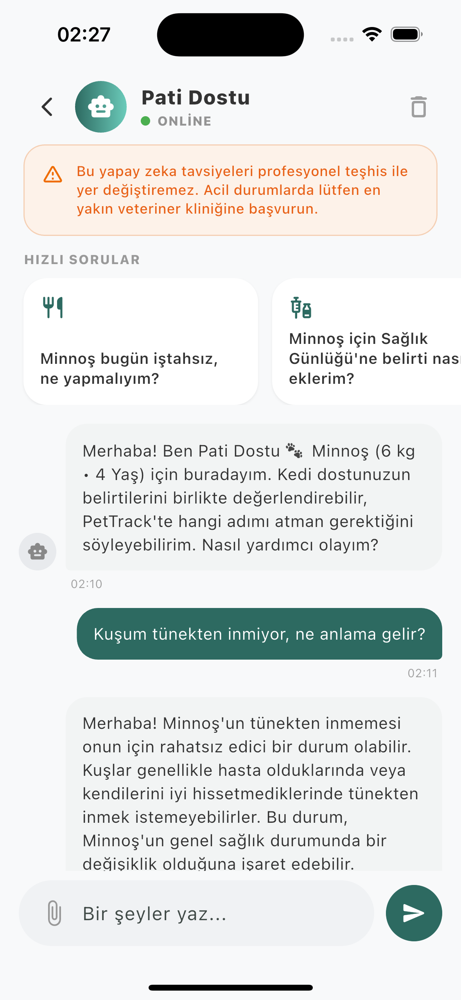

# 📱 PetTrack — Flutter Mobil

iOS ve Android için tek kod tabanı — web ile **aynı REST API**'yi kullanır.

| | |
|---|---|
| **Stack** | Flutter · Dart |
| **API** | `ApiService` → `NEXT_PUBLIC_API_URL` (varsayılan `localhost:1571`) |
| **Tema** | `lib/theme/app_colors.dart` |

---

## Ekranlar

| Ekran | Dosya | API |
|-------|-------|-----|
| Profil | `screens/profile_screen.dart` | `/api/pets`, `/api/uploads`, DELETE pet |
| Takvim | `screens/calendar_screen.dart` | `/api/calendar` |
| Sağlık günlüğü | `screens/health_diary_screen.dart` | `/api/symptoms` |
| Beslenme | `screens/nutrition_screen.dart` | `/api/nutrition`, summary |
| Pati Dostu AI | `screens/assistant_screen.dart` | `/api/chat` |

Paylaşılan: `PtHeader` (aktif pet avatar), `PtBottomNav`, `ActivePetScope`

---

## Çalıştırma

```bash
# Backend önce çalışmalı
npm run dev   # kökten

cd frontend/mobile
flutter pub get
flutter run
```

**Fiziksel cihaz (yerel backend):**

```bash
flutter run --dart-define=NEXT_API_BASE=http://BILGISAYAR_IP:1571
```

**Canlı API:**

```bash
flutter run --dart-define=NEXT_API_BASE=https://pettrack-backend.vercel.app
```

---

## Ekran görüntüsü



---

## Platform iskeleti

Eksik platform dosyası varsa:

```bash
flutter create . --platforms=android,ios
flutter pub get
```

---

Ana README: [../../README.md](../../README.md)
